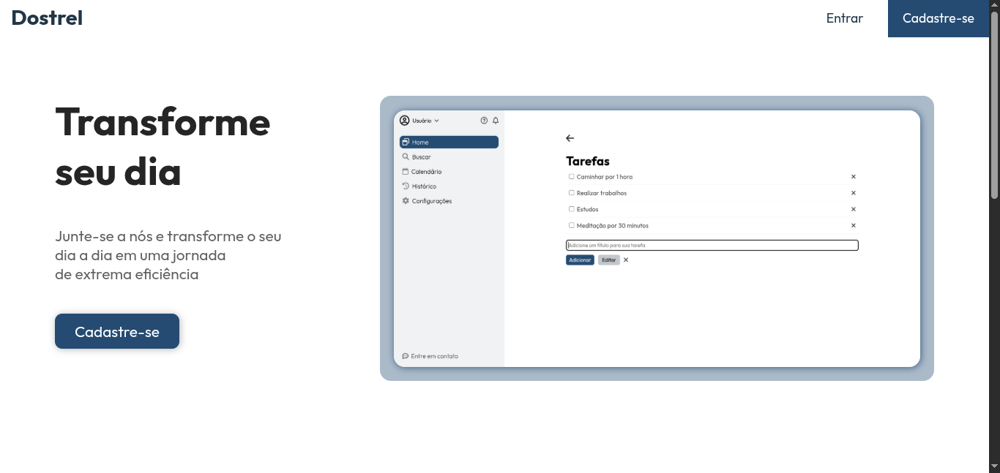
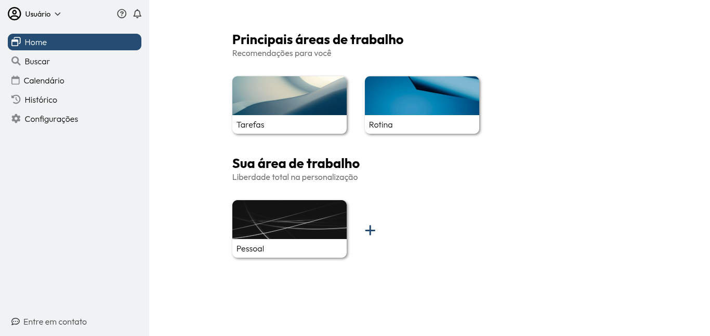
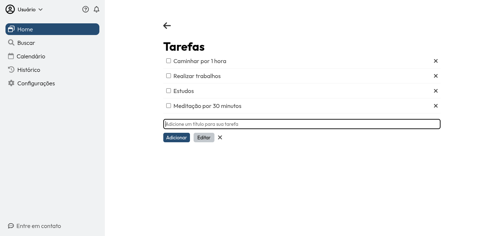

# To-Do-List

## 📌 Sobre o Projeto
To-Do-List desenvolvido para ajudar os usuários a organizarem suas tarefas diárias de maneira simples e eficiente. O aplicativo permite o gerenciamento de tarefas com prazos e status, além de fornecer uma interface intuitiva para facilitar o acompanhamento de atividades.

## 🚀 Tecnologias Utilizadas
- **Front-end:** HTML5, CSS3, JavaScript  
- **Back-end:** Node.js, Express  
- **Banco de Dados:** MySQL  

## Funcionalidades
- Cadastro e login de usuários

- Criação, edição e remoção de tarefas

- Definição de prazos e categorias para as tarefas

- Marcação de status (concluída, em andamento, pendente)

## Imagens do Projeto

